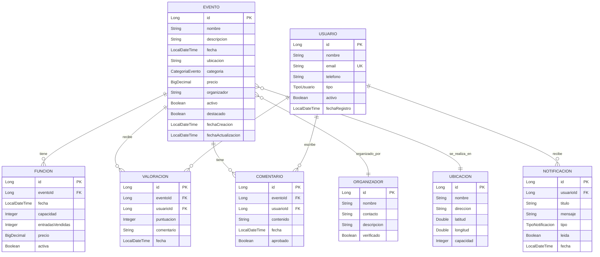

# Diagrama C4 Completo Unificado - ViveMedellin

## 🏗️ Arquitectura Completa en Una Vista

Este diagrama muestra todos los niveles del modelo C4 integrados en una sola visualización comprensiva.

```mermaid
graph TB
    %% Usuarios (Nivel 1: Contexto)
    subgraph "👥 USUARIOS"
        U1[👨‍💼 Ciudadano<br/>• Busca eventos<br/>• Valora y comenta<br/>• Compra tickets]
        U2[👩‍💼 Organizador<br/>• Crea eventos<br/>• Gestiona funciones<br/>• Promociona]
        U3[👨‍💻 Administrador<br/>• Supervisa plataforma<br/>• Gestiona usuarios<br/>• Analiza métricas]
    end

    %% Interfaces (Nivel 2: Contenedores - Frontend)
    subgraph "📱 INTERFACES"
        WEB[💻 Web App<br/>React.js + TypeScript<br/>Responsive Design]
        MOB[📱 Mobile App<br/>React Native<br/>iOS + Android]
        ADM[🖥️ Admin Panel<br/>React.js + Material-UI<br/>Dashboard Avanzado]
    end

    %% Gateway (Nivel 2: Contenedores - Gateway)
    GW[🚪 API Gateway<br/>Spring Cloud Gateway<br/>• Enrutamiento<br/>• Rate Limiting<br/>• CORS]

    %% Backend Services (Nivel 2 + 3: Contenedores + Componentes)
    subgraph "🏗️ BACKEND API - Spring Boot 3.5.6"
        subgraph "🎯 CONTROLLERS"
            EC[EventoController<br/>@RestController<br/>15+ endpoints]
            UC[UsuarioController<br/>@RestController<br/>Gestión usuarios]
            VC[ValoracionController<br/>@RestController<br/>Sistema valoraciones]
            NC[NotificacionController<br/>@RestController<br/>Push notifications]
        end
        
        subgraph "⚙️ SERVICES"
            ES[EventoService<br/>• Crear/Actualizar<br/>• Destacar/Cancelar<br/>• Búsqueda avanzada]
            US[UsuarioService<br/>• Registro<br/>• Autenticación<br/>• Gestión perfiles]
            VS[ValoracionService<br/>• Sistema puntuación<br/>• Comentarios<br/>• Moderación]
            SS[SearchService<br/>• Indexación<br/>• Filtros avanzados<br/>• Geolocalización]
            NS[NotificationService<br/>• Email/SMS<br/>• Push real-time<br/>• Preferencias]
        end
        
        subgraph "🗃️ REPOSITORIES"
            ER[EventoRepository<br/>Spring Data JPA<br/>Queries personalizadas]
            UR[UsuarioRepository<br/>Spring Data JPA<br/>Autenticación]
            VR[ValoracionRepository<br/>Spring Data JPA<br/>Agregaciones]
            FR[FuncionRepository<br/>Spring Data JPA<br/>Disponibilidad]
        end

        subgraph "🔧 CONFIGURACIÓN"
            SEC[SecurityConfig<br/>JWT + CORS<br/>Roles y permisos]
            SWG[SwaggerConfig<br/>OpenAPI 3.0<br/>Documentación auto]
            EXH[ExceptionHandler<br/>@ControllerAdvice<br/>Errores centralizados]
        end
    end

    %% Microservices (Nivel 2: Contenedores - Servicios)
    AUTH[🔐 Auth Service<br/>Spring Security<br/>JWT + OAuth2]
    NOTIF[📢 Notification Service<br/>Spring Boot + WebSocket<br/>Real-time push]

    %% Almacenamiento (Nivel 2: Contenedores - Persistencia)
    subgraph "💾 CAPA DE PERSISTENCIA"
        PG[(🐘 PostgreSQL 18<br/>Base de datos principal<br/>ACID + Extensions)]
        RD[(🚀 Redis Cluster<br/>Cache distribuido<br/>Sesiones + API cache)]
        ES_DB[(🔍 Elasticsearch<br/>Motor de búsqueda<br/>Índices optimizados)]
    end

    %% External Systems (Nivel 1: Sistemas Externos)
    subgraph "🌐 SISTEMAS EXTERNOS"
        EMAIL[📧 Email Service<br/>SendGrid/AWS SES]
        PAY[💳 Payment Gateway<br/>Stripe/PayU Colombia]
        MAPS[🗺️ Google Maps API<br/>Geolocalización]
        SOCIAL[📲 Redes Sociales<br/>Facebook/Instagram]
        STORAGE[📁 File Storage<br/>AWS S3/MinIO<br/>Imágenes y docs]
    end

    %% Relaciones Usuarios -> Interfaces
    U1 -.-> WEB
    U1 -.-> MOB
    U2 -.-> WEB
    U3 -.-> ADM

    %% Relaciones Interfaces -> Gateway
    WEB --> GW
    MOB --> GW
    ADM --> GW

    %% Relaciones Gateway -> Controllers
    GW --> EC
    GW --> UC
    GW --> VC
    GW --> NC

    %% Relaciones Controllers -> Services
    EC --> ES
    UC --> US
    VC --> VS
    NC --> NS

    %% Relaciones Services -> Repositories
    ES --> ER
    ES --> FR
    US --> UR
    VS --> VR

    %% Relaciones Inter-Service
    ES -.-> SS
    ES -.-> NS
    US -.-> NS

    %% Relaciones Repositories -> Database
    ER --> PG
    UR --> PG
    VR --> PG
    FR --> PG

    %% Relaciones Cache
    ES -.-> RD
    US -.-> RD
    AUTH -.-> RD

    %% Relaciones Search
    SS --> ES_DB

    %% Relaciones Gateway -> Services
    GW -.-> AUTH
    GW -.-> NOTIF

    %% Relaciones Servicios Externos
    NS --> EMAIL
    ES --> PAY
    ES --> MAPS
    NS --> SOCIAL
    ES --> STORAGE

    %% Relaciones Cross-cutting
    SEC -.-> AUTH
    EXH -.-> EC
    EXH -.-> UC
    SWG -.-> EC

    %% Estilos
    classDef userClass fill:#e1f5fe,stroke:#01579b,stroke-width:2px
    classDef frontendClass fill:#f3e5f5,stroke:#4a148c,stroke-width:2px
    classDef backendClass fill:#e8f5e8,stroke:#1b5e20,stroke-width:2px
    classDef dataClass fill:#fff3e0,stroke:#e65100,stroke-width:2px
    classDef externalClass fill:#fce4ec,stroke:#880e4f,stroke-width:2px
    classDef serviceClass fill:#e3f2fd,stroke:#0d47a1,stroke-width:2px

    class U1,U2,U3 userClass
    class WEB,MOB,ADM frontendClass
    class EC,UC,VC,NC,ES,US,VS,SS,NS,ER,UR,VR,FR,SEC,SWG,EXH backendClass
    class PG,RD,ES_DB dataClass
    class EMAIL,PAY,MAPS,SOCIAL,STORAGE externalClass
    class AUTH,NOTIF,GW serviceClass
```

## 📊 Nivel 4: Modelo de Dominio (Entidades Principales)



## 🎯 Características Implementadas por Nivel

### 🏛️ **Nivel 1 - Contexto del Sistema**
- ✅ **3 tipos de usuarios:** Ciudadanos, Organizadores, Administradores
- ✅ **4 sistemas externos:** Email, Pagos, Mapas, Redes Sociales
- ✅ **Integración completa** con APIs externas

### 📦 **Nivel 2 - Contenedores**
- ✅ **Frontend multiplataforma:** Web (React.js) + Mobile (React Native)
- ✅ **Backend robusto:** Spring Boot 3.5.6 + Java 21
- ✅ **Persistencia optimizada:** PostgreSQL 18 + Redis + Elasticsearch
- ✅ **Arquitectura de microservicios** modular

### ⚙️ **Nivel 3 - Componentes**
- ✅ **15+ endpoints REST** documentados con Swagger
- ✅ **Arquitectura en capas:** Controller → Service → Repository → Entity
- ✅ **Seguridad robusta:** JWT + Spring Security + CORS
- ✅ **Manejo de errores** centralizado y validaciones multi-nivel

### 💻 **Nivel 4 - Código**
- ✅ **9 entidades JPA** con relaciones bien definidas
- ✅ **Soft delete** y timestamps automáticos
- ✅ **Enumeraciones** para categorías, tipos de usuario y notificaciones
- ✅ **Value Objects** para coordenadas y períodos

## 🚀 Flujos de Datos Principales

### 1. **Crear Evento**
```
Organizador → Web App → API Gateway → EventoController → EventoService → EventoRepository → PostgreSQL
                                    ↓
                              NotificationService → Email/Push
                                    ↓
                              SearchService → Elasticsearch
```

### 2. **Buscar Eventos**
```
Usuario → Mobile App → API Gateway → EventoController → EventoService → Cache (Redis)
                                                     ↓ (si no está en cache)
                                              EventoRepository → PostgreSQL
                                                     ↓
                                              SearchService → Elasticsearch
```

### 3. **Valorar Evento**
```
Usuario → Web App → API Gateway → ValoracionController → ValoracionService → ValoracionRepository → PostgreSQL
                                                      ↓
                                              EventoService.actualizarPromedio() → PostgreSQL
```

## 📈 Métricas de Arquitectura

| Componente | Tecnología | Performance Target |
|------------|------------|-------------------|
| **API Response** | Spring Boot | < 200ms |
| **Database Query** | PostgreSQL 18 | < 50ms |
| **Cache Hit Ratio** | Redis | > 80% |
| **Search Query** | Elasticsearch | < 100ms |
| **File Upload** | AWS S3/MinIO | < 2s |

---

**🎊 Esta vista unificada te permite ver toda la arquitectura ViveMedellin de un vistazo, desde los usuarios finales hasta el modelo de datos, pasando por todos los componentes técnicos intermedios.**