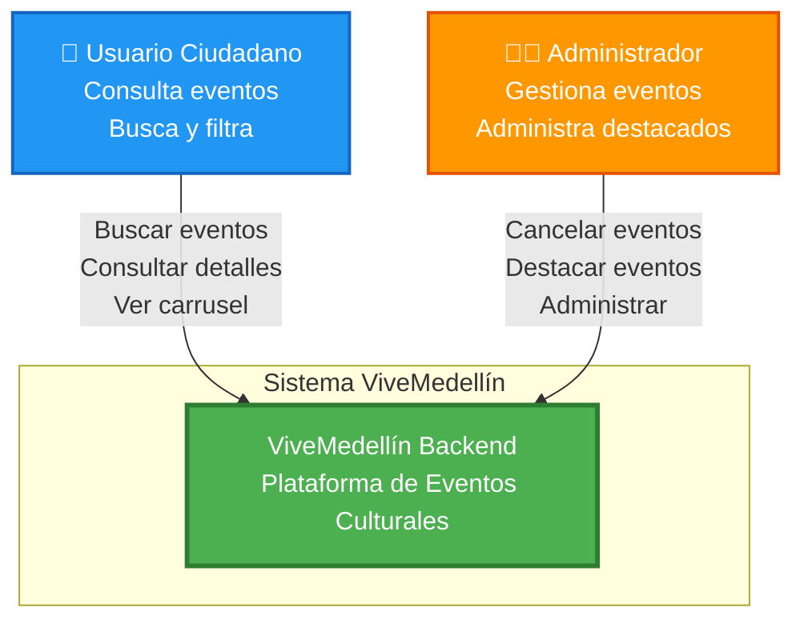
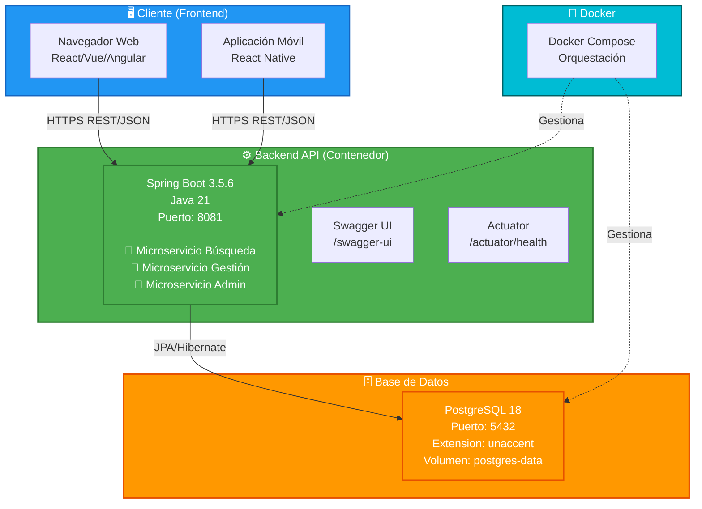
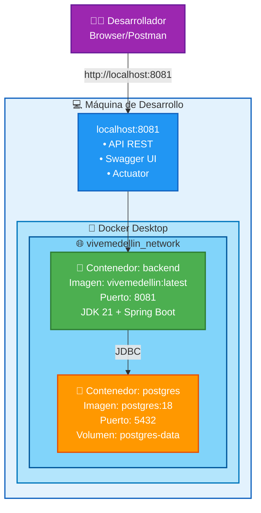
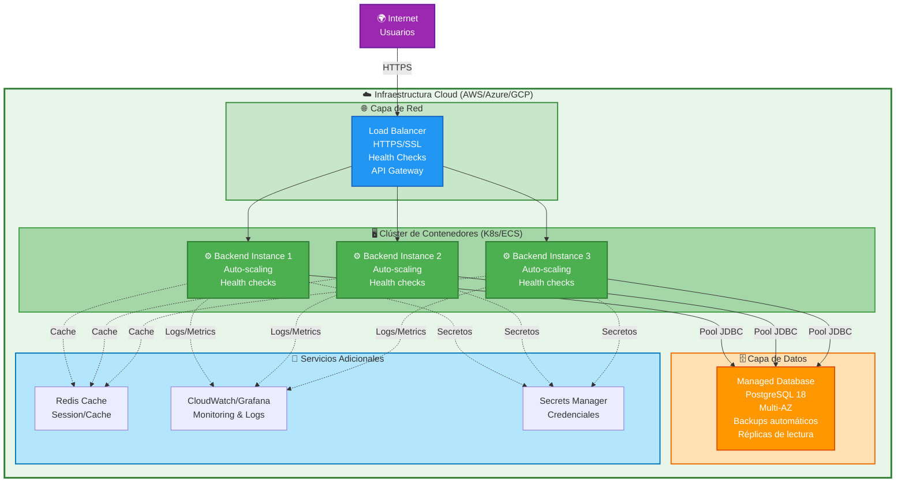
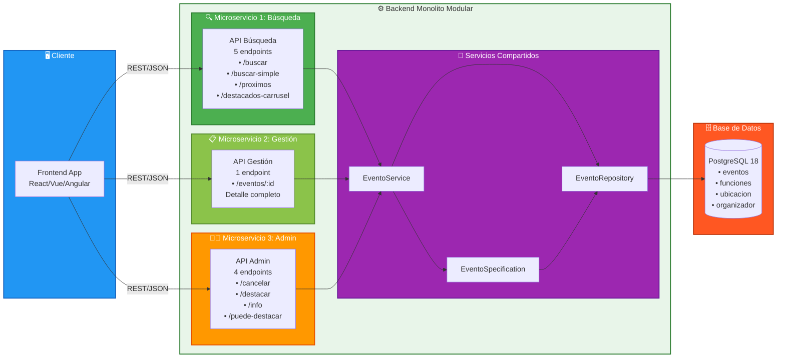
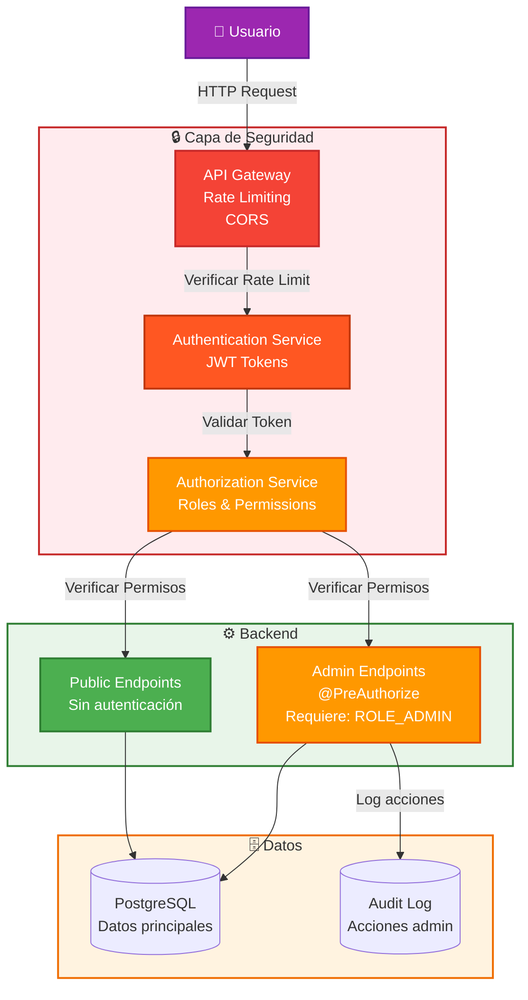
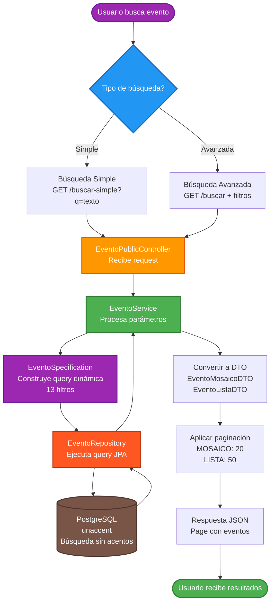
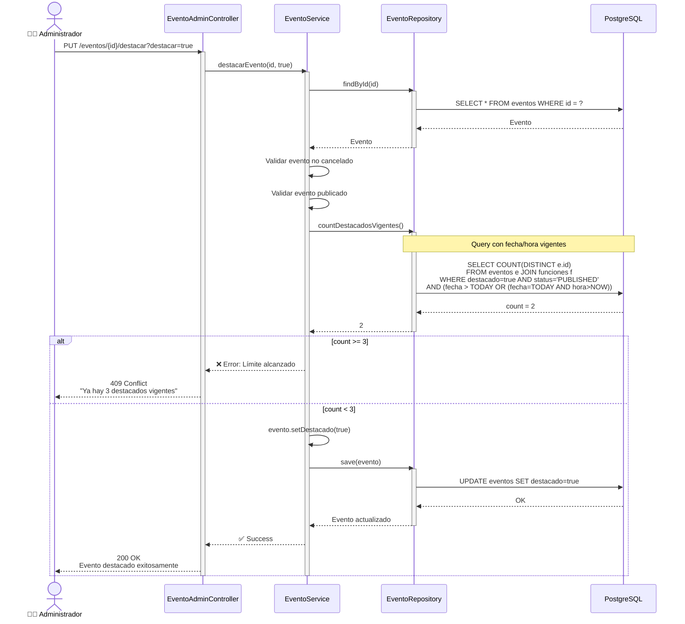
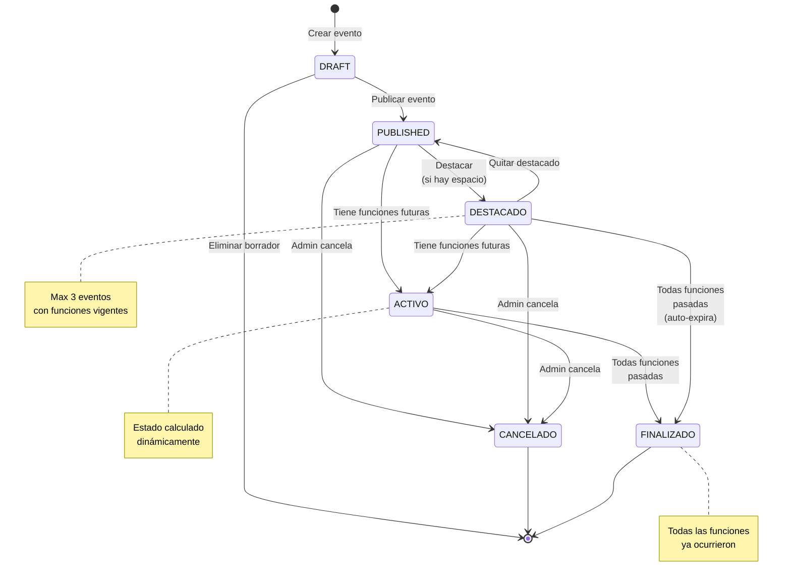

# 🎨 Diagramas Visuales de Despliegue - ViveMedellín

Este documento contiene versiones visuales de los diagramas de despliegue usando **Mermaid** y **PlantUML**, que se renderizan automáticamente en GitHub, VSCode y otras herramientas.

---

## 📊 Nivel 1: Diagrama de Contexto del Sistema



---

## 🏢 Nivel 2: Diagrama de Contenedores



---

## 🔧 Nivel 3: Diagrama de Componentes (Backend)

```mermaid
graph TB
    subgraph CONTROLLERS["📡 Capa de Controladores"]
        PUBLIC_CTRL[EventoPublicController<br/>5 endpoints públicos]
        ADMIN_CTRL[EventoAdminController<br/>4 endpoints admin]
        ACTUATOR_CTRL[Actuator Endpoints<br/>Health, Metrics]
    end
    
    subgraph SERVICES["🔄 Capa de Servicios"]
        EVENTO_SVC[EventoService<br/>• Lógica de negocio<br/>• Conversión DTOs<br/>• Cálculo estados<br/>• Validaciones]
    end
    
    subgraph SPECS["🔍 Capa de Especificaciones"]
        EVENTO_SPEC[EventoSpecification<br/>• 13 filtros dinámicos<br/>• JPA Criteria API<br/>• Búsqueda sin acentos]
    end
    
    subgraph REPOS["💾 Capa de Repositorios"]
        EVENTO_REPO[EventoRepository<br/>• JpaRepository<br/>• Queries personalizadas<br/>• countDestacadosVigentes<br/>• findDestacadosVigentes]
    end
    
    subgraph MODELS["📦 Capa de Modelo"]
        EVENTO[Evento<br/>@Entity]
        FUNCION[Funcion<br/>@Entity]
        UBICACION[Ubicacion<br/>@Embeddable]
        ORGANIZADOR[Organizador<br/>@Embeddable]
    end
    
    subgraph CONFIG["⚙️ Capa de Configuración"]
        OPENAPI[OpenAPI Config<br/>Swagger]
        CORS[CORS Config]
        JPA[JPA Properties]
    end
    
    PUBLIC_CTRL --> EVENTO_SVC
    ADMIN_CTRL --> EVENTO_SVC
    EVENTO_SVC --> EVENTO_SPEC
    EVENTO_SVC --> EVENTO_REPO
    EVENTO_SPEC --> EVENTO_REPO
    EVENTO_REPO --> EVENTO
    EVENTO_REPO --> FUNCION
    EVENTO --> UBICACION
    EVENTO --> ORGANIZADOR
    
    style CONTROLLERS fill:#2196F3,stroke:#1565C0,stroke-width:2px,color:#fff
    style SERVICES fill:#4CAF50,stroke:#2E7D32,stroke-width:2px,color:#fff
    style SPECS fill:#9C27B0,stroke:#6A1B9A,stroke-width:2px,color:#fff
    style REPOS fill:#FF9800,stroke:#E65100,stroke-width:2px,color:#fff
    style MODELS fill:#F44336,stroke:#C62828,stroke-width:2px,color:#fff
    style CONFIG fill:#607D8B,stroke:#37474F,stroke-width:2px,color:#fff
```

---

## 🚀 Nivel 4: Diagrama de Despliegue - Desarrollo Local



---

## ☁️ Nivel 4: Diagrama de Despliegue - Producción Cloud



---

## 🔄 Pipeline CI/CD Completo

```mermaid
graph TB
    START([🚀 Push/PR a main/develop])
    
    subgraph STAGE1["📦 Stage 1: Build & Test"]
        CHECKOUT[Checkout Code<br/>Git Clone]
        SETUP_JAVA[Setup JDK 21<br/>Cache Maven]
        BUILD[Maven Build<br/>mvn compile]
        TEST[Run Tests<br/>mvn test<br/>PostgreSQL Container]
        UPLOAD_TESTS[Upload Test Results]
    end
    
    subgraph STAGE2["🔒 Stage 2: Security"]
        OWASP[OWASP Dependency Check<br/>CVE Scanner]
        TRIVY[Trivy Vulnerability Scan<br/>Filesystem]
        UPLOAD_SARIF[Upload to GitHub Security]
    end
    
    subgraph STAGE3["📊 Stage 3: Quality"]
        SONAR[SonarCloud Analysis<br/>Code Quality]
    end
    
    subgraph STAGE4["🐳 Stage 4: Docker"]
        DOCKER_BUILD[Build Docker Image<br/>Multi-stage]
        DOCKER_TAG[Tag Image<br/>latest, version, SHA]
        DOCKER_PUSH[Push to Registry<br/>Docker Hub + GHCR]
        TRIVY_IMAGE[Trivy Image Scan]
    end
    
    subgraph STAGE5["🚀 Stage 5: Deploy"]
        DEPLOY_STAGING{Branch = develop?}
        DEPLOY_PROD{Branch = main?}
        STAGING[Deploy to Staging<br/>Health Check]
        PRODUCTION[Deploy to Production<br/>Health Check]
    end
    
    NOTIFY[📧 Notifications<br/>Slack/Email<br/>GitHub Status]
    
    START --> CHECKOUT
    CHECKOUT --> SETUP_JAVA
    SETUP_JAVA --> BUILD
    BUILD --> TEST
    TEST --> UPLOAD_TESTS
    
    UPLOAD_TESTS --> OWASP
    OWASP --> TRIVY
    TRIVY --> UPLOAD_SARIF
    
    UPLOAD_SARIF --> SONAR
    
    SONAR --> DOCKER_BUILD
    DOCKER_BUILD --> DOCKER_TAG
    DOCKER_TAG --> DOCKER_PUSH
    DOCKER_PUSH --> TRIVY_IMAGE
    
    TRIVY_IMAGE --> DEPLOY_STAGING
    DEPLOY_STAGING -->|Yes| STAGING
    DEPLOY_STAGING -->|No| DEPLOY_PROD
    DEPLOY_PROD -->|Yes| PRODUCTION
    DEPLOY_PROD -->|No| NOTIFY
    
    STAGING --> NOTIFY
    PRODUCTION --> NOTIFY
    
    style START fill:#9C27B0,stroke:#6A1B9A,stroke-width:2px,color:#fff
    style STAGE1 fill:#E3F2FD,stroke:#1565C0,stroke-width:2px
    style STAGE2 fill:#FFEBEE,stroke:#C62828,stroke-width:2px
    style STAGE3 fill:#FFF3E0,stroke:#EF6C00,stroke-width:2px
    style STAGE4 fill:#E0F2F1,stroke:#00695C,stroke-width:2px
    style STAGE5 fill:#F3E5F5,stroke:#6A1B9A,stroke-width:2px
    style NOTIFY fill:#4CAF50,stroke:#2E7D32,stroke-width:2px,color:#fff
```



---

## 🏗️ Arquitectura de Microservicios



---

## 🔐 Arquitectura de Seguridad (Futura)



---

## 📱 Diagrama de Flujo - Búsqueda de Eventos



---

## 🎯 Diagrama de Secuencia - Sistema de Destacados



---

## 📊 Diagrama de Estados - Ciclo de Vida del Evento



---

## 🛠️ Cómo Ver Estos Diagramas

### En GitHub
✅ Los diagramas Mermaid se renderizan **automáticamente** al visualizar este archivo en GitHub.

### En VS Code
1. Instalar extensión: **Markdown Preview Mermaid Support**
2. Abrir preview: `Ctrl+Shift+V` (Windows/Linux) o `Cmd+Shift+V` (Mac)
3. Los diagramas se renderizan automáticamente

### En Otras Herramientas
- **Notion**: Soporta Mermaid nativamente
- **Confluence**: Plugin de Mermaid
- **GitLab**: Soporte nativo de Mermaid
- **Obsidian**: Soporte nativo de Mermaid

### Exportar a Imagen
**Opción 1: Mermaid Live Editor**
1. Ir a https://mermaid.live/
2. Pegar el código del diagrama
3. Exportar como PNG/SVG

**Opción 2: VS Code**
1. Instalar: **Markdown PDF**
2. Click derecho → "Markdown PDF: Export (png)"

**Opción 3: CLI**
```bash
npm install -g @mermaid-js/mermaid-cli
mmdc -i DIAGRAMAS_VISUALES.md -o diagrama.png
```

---

## 🎨 Paleta de Colores Usada

| Color | Uso | Hex |
|-------|-----|-----|
| 🔵 Azul | Frontend, Usuario | #2196F3 |
| 🟢 Verde | Backend, Success | #4CAF50 |
| 🟠 Naranja | Admin, Database | #FF9800 |
| 🟣 Morado | Seguridad, Config | #9C27B0 |
| 🔴 Rojo | Errores, Crítico | #F44336 |
| ⚫ Gris | Infraestructura | #607D8B |

---

## 📝 Notas Técnicas

### Ventajas de Mermaid
- ✅ Renderizado automático en GitHub/GitLab
- ✅ Versionado en Git (texto plano)
- ✅ Fácil de actualizar
- ✅ No requiere herramientas externas
- ✅ Soportado por múltiples plataformas

### Limitaciones
- ⚠️ Menos personalización que tools gráficos
- ⚠️ Sintaxis puede ser compleja para diagramas grandes
- ⚠️ No todos los tipos de diagramas UML están soportados

### Alternativas
- **PlantUML**: Más potente, requiere servidor
- **Draw.io**: Visual, archivos binarios
- **Lucidchart**: Comercial, colaborativo
- **Excalidraw**: Hand-drawn style

---

## ✅ Resumen

Este documento contiene **9 diagramas visuales** renderizables:

1. ✅ Contexto del Sistema
2. ✅ Diagrama de Contenedores
3. ✅ Diagrama de Componentes
4. ✅ Despliegue Local (Docker)
5. ✅ Despliegue Producción (Cloud)
6. ✅ Pipeline CI/CD
7. ✅ Arquitectura de Microservicios
8. ✅ Arquitectura de Seguridad
9. ✅ Flujo de Búsqueda
10. ✅ Secuencia de Destacados
11. ✅ Estados del Evento

**Total**: 11 diagramas interactivos en formato Mermaid

---

**Visualiza este archivo en GitHub para ver los diagramas renderizados automáticamente! 🎉**
