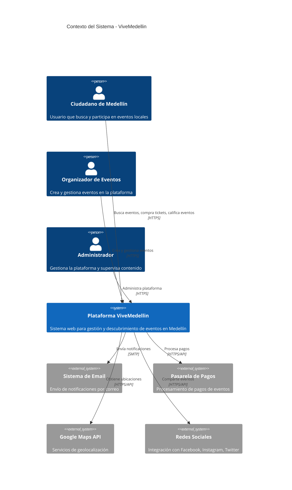
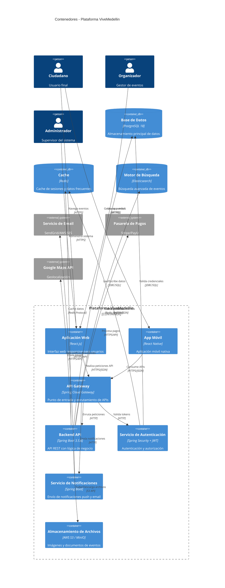

# Modelo C4 - Plataforma ViveMedellin
## Documentación de Arquitectura de Software

### Descripción General
ViveMedellin es una plataforma integral para la gestión y promoción de eventos culturales, gastronómicos, deportivos y de entretenimiento en la ciudad de Medellín. El sistema permite a los ciudadanos descubrir eventos, a los organizadores gestionar sus actividades y a los administradores supervisar la plataforma.

---

## Nivel 1: Diagrama de Contexto del Sistema



---

## Nivel 2: Diagrama de Contenedores



---

## Nivel 3: Diagrama de Componentes - Backend API

```mermaid
C4Component
    title Componentes - Backend API (Spring Boot)

    Container(web_app, "Aplicación Web", "React.js", "Frontend web")
    Container(mobile_app, "App Móvil", "React Native", "Frontend móvil")

    Container_Boundary(api, "Backend API - Spring Boot") {
        Component(evento_controller, "EventoController", "Spring MVC Controller", "API REST para gestión de eventos")
        Component(usuario_controller, "UsuarioController", "Spring MVC Controller", "API REST para gestión de usuarios")
        Component(valoracion_controller, "ValoracionController", "Spring MVC Controller", "API REST para valoraciones y comentarios")
        Component(notificacion_controller, "NotificacionController", "Spring MVC Controller", "API REST para notificaciones")

        Component(evento_service, "EventoService", "Spring Service", "Lógica de negocio para eventos")
        Component(usuario_service, "UsuarioService", "Spring Service", "Lógica de negocio para usuarios")
        Component(valoracion_service, "ValoracionService", "Spring Service", "Lógica de negocio para valoraciones")
        Component(notificacion_service, "NotificacionService", "Spring Service", "Lógica de negocio para notificaciones")
        Component(search_service, "SearchService", "Spring Service", "Servicio de búsqueda avanzada")

        Component(evento_repository, "EventoRepository", "Spring Data JPA", "Acceso a datos de eventos")
        Component(usuario_repository, "UsuarioRepository", "Spring Data JPA", "Acceso a datos de usuarios")
        Component(valoracion_repository, "ValoracionRepository", "Spring Data JPA", "Acceso a datos de valoraciones")
        Component(notificacion_repository, "NotificacionRepository", "Spring Data JPA", "Acceso a datos de notificaciones")
        Component(funcion_repository, "FuncionRepository", "Spring Data JPA", "Acceso a datos de funciones")

        Component(security_config, "SecurityConfig", "Spring Security", "Configuración de seguridad y JWT")
        Component(swagger_config, "SwaggerConfig", "SpringDoc OpenAPI", "Documentación automática de API")
        Component(exception_handler, "GlobalExceptionHandler", "Spring @ControllerAdvice", "Manejo global de excepciones")
    }

    ContainerDb(database, "PostgreSQL 18", "Base de Datos", "Almacenamiento persistente")
    ContainerDb(cache, "Redis", "Cache", "Cache distribuido")
    Container(search_engine, "Elasticsearch", "Motor de Búsqueda", "Búsqueda indexada")

    Rel(web_app, evento_controller, "GET/POST/PUT/DELETE /api/eventos", "HTTPS/JSON")
    Rel(web_app, usuario_controller, "GET/POST/PUT /api/usuarios", "HTTPS/JSON")
    Rel(mobile_app, evento_controller, "Consume API eventos", "HTTPS/JSON")
    Rel(mobile_app, valoracion_controller, "Envía valoraciones", "HTTPS/JSON")

    Rel(evento_controller, evento_service, "Llama métodos de negocio", "Java")
    Rel(usuario_controller, usuario_service, "Gestiona usuarios", "Java")
    Rel(valoracion_controller, valoracion_service, "Procesa valoraciones", "Java")
    Rel(notificacion_controller, notificacion_service, "Envía notificaciones", "Java")

    Rel(evento_service, evento_repository, "CRUD eventos", "JPA/Hibernate")
    Rel(evento_service, search_service, "Indexa eventos", "Java")
    Rel(usuario_service, usuario_repository, "CRUD usuarios", "JPA/Hibernate")
    Rel(valoracion_service, valoracion_repository, "CRUD valoraciones", "JPA/Hibernate")
    Rel(notificacion_service, notificacion_repository, "CRUD notificaciones", "JPA/Hibernate")

    Rel(evento_repository, database, "SQL Queries", "JDBC")
    Rel(usuario_repository, database, "SQL Queries", "JDBC")
    Rel(valoracion_repository, database, "SQL Queries", "JDBC")
    Rel(funcion_repository, database, "SQL Queries", "JDBC")

    Rel(search_service, search_engine, "Indexa/Busca", "HTTP/JSON")
    Rel(evento_service, cache, "Cache eventos populares", "Redis Protocol")

    UpdateLayoutConfig($c4ShapeInRow="3", $c4BoundaryInRow="1")
```



---

## Nivel 4: Diagrama de Código - Modelo de Dominio

```mermaid
classDiagram
    class Evento {
        -Long id
        -String nombre
        -String descripcion
        -LocalDateTime fecha
        -String ubicacion
        -CategoriaEvento categoria
        -BigDecimal precio
        -String organizador
        -Boolean activo
        -Boolean destacado
        -LocalDateTime fechaCreacion
        -LocalDateTime fechaActualizacion
        +crear()
        +actualizar()
        +destacar()
        +cancelar()
        +buscarPorCategoria()
        +buscarPorFecha()
    }

    class Usuario {
        -Long id
        -String nombre
        -String email
        -String telefono
        -TipoUsuario tipo
        -Boolean activo
        -LocalDateTime fechaRegistro
        +registrar()
        +actualizar()
        +desactivar()
        +cambiarTipo()
    }

    class Funcion {
        -Long id
        -Long eventoId
        -LocalDateTime fecha
        -Integer capacidad
        -Integer entradasVendidas
        -BigDecimal precio
        -Boolean activa
        +crear()
        +venderEntrada()
        +cancelar()
        +verificarDisponibilidad()
    }

    class Valoracion {
        -Long id
        -Long eventoId
        -Long usuarioId
        -Integer puntuacion
        -String comentario
        -LocalDateTime fecha
        +crear()
        +actualizar()
        +eliminar()
    }

    class Comentario {
        -Long id
        -Long eventoId
        -Long usuarioId
        -String contenido
        -LocalDateTime fecha
        -Boolean aprobado
        +crear()
        +aprobar()
        +rechazar()
    }

    class Notificacion {
        -Long id
        -Long usuarioId
        -String titulo
        -String mensaje
        -TipoNotificacion tipo
        -Boolean leida
        -LocalDateTime fecha
        +enviar()
        +marcarLeida()
    }

    class Organizador {
        -Long id
        -String nombre
        -String contacto
        -String descripcion
        -Boolean verificado
        +verificar()
        +actualizar()
    }

    class Ubicacion {
        -Long id
        -String nombre
        -String direccion
        -Double latitud
        -Double longitud
        -Integer capacidad
        +geocodificar()
        +calcularDistancia()
    }

    class Grupo {
        -Long id
        -String nombre
        -String descripcion
        -Long creadorId
        -LocalDateTime fechaCreacion
        +crear()
        +agregarMiembro()
        +removerMiembro()
    }

    %% Relaciones
    Evento ||--o{ Funcion : "tiene"
    Evento ||--o{ Valoracion : "recibe"
    Evento ||--o{ Comentario : "tiene"
    Usuario ||--o{ Valoracion : "crea"
    Usuario ||--o{ Comentario : "escribe"
    Usuario ||--o{ Notificacion : "recibe"
    Usuario ||--o{ Grupo : "pertenece"
    Evento }o--|| Organizador : "organizado por"
    Evento }o--|| Ubicacion : "se realiza en"

    %% Enums
    class CategoriaEvento {
        <<enumeration>>
        MUSICA
        GASTRONOMIA
        DEPORTE
        CULTURA
        TECNOLOGIA
        ARTE
        EDUCACION
        NEGOCIOS
    }

    class TipoUsuario {
        <<enumeration>>
        CIUDADANO
        ORGANIZADOR
        ADMINISTRADOR
    }

    class TipoNotificacion {
        <<enumeration>>
        NUEVO_EVENTO
        RECORDATORIO
        CONFIRMACION
        PROMOCION
        SISTEMA
    }

    Evento --> CategoriaEvento
    Usuario --> TipoUsuario
    Notificacion --> TipoNotificacion
```

---

## Tecnologías y Patrones Implementados

### Backend (Spring Boot 3.5.6)
- **Arquitectura**: Arquitectura en capas (Controller → Service → Repository → Entity)
- **Persistencia**: JPA/Hibernate con PostgreSQL 18
- **Seguridad**: Spring Security con JWT
- **Documentación**: SpringDoc OpenAPI (Swagger)
- **Cache**: Redis para optimización de consultas
- **Patrones**: Repository Pattern, Service Layer, DTO Pattern

### Base de Datos (PostgreSQL 18)
- **Extensiones**: uuid-ossp, pg_trgm para búsqueda de texto
- **Estrategia**: DDL auto-update para desarrollo
- **Conexión**: HikariCP pool de conexiones
- **Índices**: Optimización para búsquedas frecuentes

### API REST
- **Endpoints**: 15+ endpoints documentados
- **Operaciones**: CRUD completo + operaciones especiales (destacar, soft delete)
- **Formato**: JSON con validaciones de entrada
- **Paginación**: Soporte para resultados paginados

### Características Especiales
- **Soft Delete**: Cancelación de eventos sin eliminación física
- **Destacar Eventos**: Funcionalidad de promoción
- **Búsqueda Avanzada**: Por categoría, fecha, ubicación, texto
- **Valoraciones**: Sistema de puntuación y comentarios
- **Notificaciones**: Sistema de alertas para usuarios
- **Multi-perfil**: Configuración dev (H2) y prod (PostgreSQL)

---

## Decisiones Arquitectónicas

### 1. **Separación de Responsabilidades**
- Controllers: Solo manejo de HTTP requests/responses
- Services: Lógica de negocio y orquestación
- Repositories: Acceso a datos específico
- Entities: Modelo de dominio con JPA

### 2. **Gestión de Estado**
- Soft delete para mantener historial
- Timestamps automáticos para auditoría
- Estados booleanos para control de flujo

### 3. **Escalabilidad**
- Cache Redis para datos frecuentes
- Pool de conexiones optimizado
- Indexación de base de datos

### 4. **Mantenibilidad**
- Documentación automática con Swagger
- Profiles para diferentes entornos
- Manejo centralizado de excepciones
- Logging estructurado

---

*Documentación generada para ViveMedellin - Plataforma de Eventos de Medellín*
*Versión: 1.0 | Fecha: Septiembre 2025*