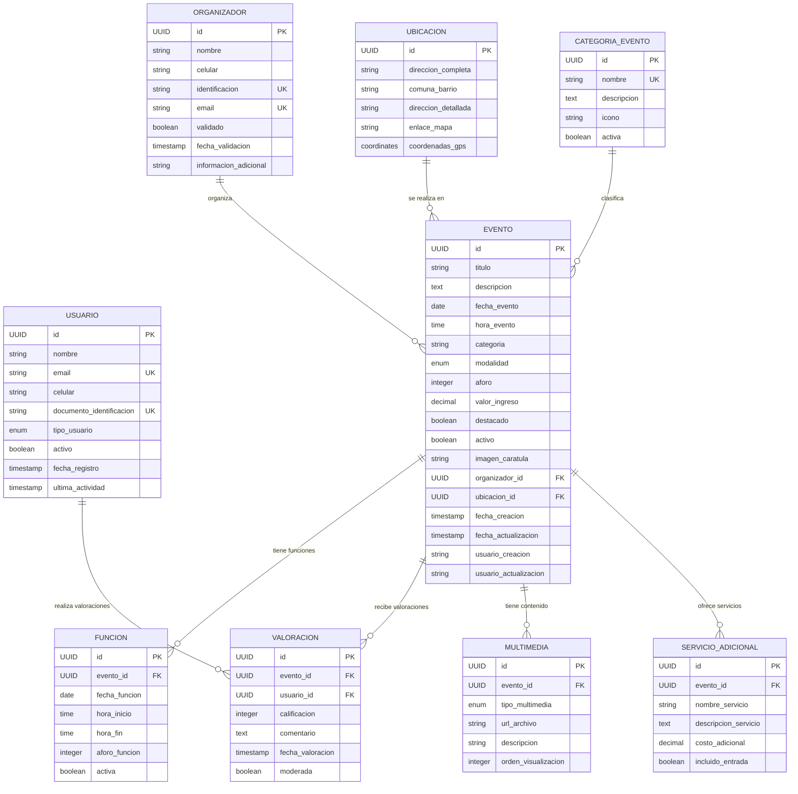

# ANÁLISIS DE BASE DE DATOS - PROYECTO VIVEMEDELLIN
## Plataforma de Gestión de Eventos Culturales de Medellín

---

**Proyecto:** ViveMedellin - Plataforma de Eventos Culturales  
**Versión:** 1.0  
**Fecha:** Septiembre 2025  
**Arquitecto de Datos:** Carlos Zuluaga  
**Product Owner:** Alcaldía de Medellín - Secretaría de Cultura  

---

## TABLA DE CONTENIDO

1. [Definición de Entidades](#1-definición-de-entidades)
2. [Principales Consultas Identificadas](#2-principales-consultas-identificadas)
3. [Modelo Lógico (MER)](#3-modelo-lógico-mer)
4. [Modelo Físico](#4-modelo-físico)
5. [Anexos y Referencias](#5-anexos-y-referencias)

---

## 1. DEFINICIÓN DE ENTIDADES

### 1.1 Contexto del Negocio
ViveMedellin es una plataforma digital que centraliza la gestión y promoción de eventos culturales en Medellín, facilitando la interacción entre organizadores, ciudadanos y la administración municipal.

### 1.2 Reglas de Negocio Identificadas

#### RN-01: Gestión de Eventos
- Todo evento debe tener un organizador identificado
- Los eventos pueden ser presenciales, virtuales o híbridos
- Un evento puede tener múltiples funciones/horarios
- Los eventos deben estar geolocalizados dentro de Medellín

#### RN-02: Sistema de Usuarios
- Los usuarios pueden ser ciudadanos u organizadores
- Los organizadores requieren validación de identidad
- Un usuario puede valorar eventos que ha asistido

#### RN-03: Gestión de Ubicaciones
- Toda ubicación debe tener dirección completa
- Debe asociarse a comuna y barrio de Medellín
- Puede incluir enlace a mapa digital

#### RN-04: Sistema de Valoraciones
- Las valoraciones van de 1 a 5 estrellas
- Un usuario solo puede valorar una vez por evento
- Las valoraciones incluyen comentarios opcionales

### 1.3 Entidades Identificadas

| **Entidad** | **Descripción** | **Propósito de Negocio** |
|-------------|-----------------|--------------------------|
| **Evento** | Evento cultural principal | Núcleo central del sistema, representa actividades culturales |
| **Usuario** | Ciudadanos y organizadores | Gestiona participantes del ecosistema cultural |
| **Organizador** | Datos específicos del organizador | Información comercial y de contacto para eventos |
| **Ubicacion** | Localización geográfica | Geolocalización precisa de eventos en la ciudad |
| **Funcion** | Horarios específicos de eventos | Maneja múltiples fechas/horas por evento |
| **Valoracion** | Calificaciones de usuarios | Sistema de retroalimentación y calidad |
| **Categoria** | Clasificación de eventos | Organización temática de eventos culturales |
| **Multimedia** | Imágenes y contenido | Material promocional y documentación visual |
| **ServicioAdicional** | Servicios complementarios | Información de servicios extra (parking, comida, etc.) |

---

## 2. PRINCIPALES CONSULTAS IDENTIFICADAS

### 2.1 Consultas de Negocio Críticas

#### CN-01: Búsqueda y Filtrado de Eventos
```sql
-- Eventos por categoría y ubicación
SELECT e.titulo, e.descripcion, u.comuna_barrio, e.fecha_evento
FROM eventos e
JOIN ubicaciones u ON e.ubicacion_id = u.id
WHERE e.categoria = ? AND u.comuna_barrio LIKE ?
AND e.activo = true;
```

#### CN-02: Ranking de Eventos Más Valorados
```sql
-- Top eventos por valoración
SELECT e.titulo, AVG(v.calificacion) as promedio, COUNT(v.id) as total_valoraciones
FROM eventos e
LEFT JOIN valoraciones v ON e.id = v.evento_id
GROUP BY e.id, e.titulo
HAVING COUNT(v.id) >= 5
ORDER BY promedio DESC, total_valoraciones DESC
LIMIT 10;
```

#### CN-03: Eventos por Proximidad Geográfica
```sql
-- Eventos cercanos por comuna
SELECT e.titulo, e.fecha_evento, u.direccion_completa
FROM eventos e
JOIN ubicaciones u ON e.ubicacion_id = u.id
WHERE u.comuna_barrio IN (?, ?, ?)
AND e.fecha_evento >= CURRENT_DATE
ORDER BY e.fecha_evento ASC;
```

### 2.2 Consultas Operacionales

#### CO-01: Dashboard Organizador
```sql
-- Resumen de eventos por organizador
SELECT 
    org.nombre,
    COUNT(e.id) as total_eventos,
    AVG(v.calificacion) as promedio_valoracion,
    SUM(CASE WHEN e.destacado = true THEN 1 ELSE 0 END) as eventos_destacados
FROM organizadores org
LEFT JOIN eventos e ON org.id = e.organizador_id
LEFT JOIN valoraciones v ON e.id = v.evento_id
WHERE org.id = ?
GROUP BY org.id, org.nombre;
```

#### CO-02: Reportes Administrativos
```sql
-- Estadísticas por categoría y período
SELECT 
    e.categoria,
    COUNT(*) as total_eventos,
    COUNT(DISTINCT e.organizador_id) as organizadores_unicos,
    AVG(v.calificacion) as calificacion_promedio
FROM eventos e
LEFT JOIN valoraciones v ON e.id = v.evento_id
WHERE e.fecha_evento BETWEEN ? AND ?
GROUP BY e.categoria
ORDER BY total_eventos DESC;
```

### 2.3 Consultas de Análisis y BI

#### CA-01: Análisis Temporal de Eventos
```sql
-- Distribución de eventos por mes
SELECT 
    EXTRACT(MONTH FROM e.fecha_evento) as mes,
    EXTRACT(YEAR FROM e.fecha_evento) as año,
    COUNT(*) as cantidad_eventos,
    COUNT(DISTINCT u.comuna_barrio) as comunas_activas
FROM eventos e
JOIN ubicaciones u ON e.ubicacion_id = u.id
GROUP BY año, mes
ORDER BY año DESC, mes DESC;
```

---

## 3. MODELO LÓGICO (MER)

### 3.1 Diagrama Entidad-Relación



### 3.2 Descripción de Relaciones

| **Relación** | **Cardinalidad** | **Descripción** |
|--------------|------------------|-----------------|
| Organizador - Evento | 1:N | Un organizador puede crear múltiples eventos |
| Ubicacion - Evento | 1:N | Una ubicación puede hospedar múltiples eventos |
| Evento - Funcion | 1:N | Un evento puede tener múltiples funciones/horarios |
| Evento - Valoracion | 1:N | Un evento puede recibir múltiples valoraciones |
| Usuario - Valoracion | 1:N | Un usuario puede valorar múltiples eventos |
| Evento - Multimedia | 1:N | Un evento puede tener múltiples archivos multimedia |
| Evento - ServicioAdicional | 1:N | Un evento puede ofrecer múltiples servicios |

### 3.3 Reglas de Integridad

#### Integridad Referencial
- Todos los eventos deben tener un organizador válido
- Todas las valoraciones deben referenciar un evento y usuario existente
- Las funciones deben pertenecer a un evento activo

#### Integridad de Dominio
- Las valoraciones deben estar entre 1 y 5
- Las fechas de eventos no pueden ser anteriores a la fecha actual
- Los emails deben tener formato válido
- Los documentos de identificación deben ser únicos

---

## 4. MODELO FÍSICO

### 4.1 Tecnología Seleccionada
- **SGBD:** PostgreSQL 18.0
- **Extensiones:** uuid-ossp, pg_trgm (búsqueda de texto)
- **Codificación:** UTF-8
- **Zona Horaria:** America/Bogota (UTC-5)

### 4.2 Definición de Tablas

#### 4.2.1 Tabla: usuarios
```sql
CREATE TABLE usuarios (
    id UUID PRIMARY KEY DEFAULT gen_random_uuid(),
    nombre VARCHAR(200) NOT NULL,
    email VARCHAR(255) UNIQUE NOT NULL,
    celular VARCHAR(15),
    documento_identificacion VARCHAR(20) UNIQUE,
    tipo_usuario tipo_usuario_enum NOT NULL DEFAULT 'CIUDADANO',
    activo BOOLEAN NOT NULL DEFAULT true,
    fecha_registro TIMESTAMP WITH TIME ZONE DEFAULT CURRENT_TIMESTAMP,
    ultima_actividad TIMESTAMP WITH TIME ZONE,
    
    -- Constraints
    CONSTRAINT ck_usuario_email CHECK (email ~* '^[A-Za-z0-9._%+-]+@[A-Za-z0-9.-]+\.[A-Za-z]{2,}$'),
    CONSTRAINT ck_usuario_celular CHECK (celular ~ '^[0-9]{10}$')
);

-- Índices
CREATE INDEX idx_usuarios_email ON usuarios(email);
CREATE INDEX idx_usuarios_documento ON usuarios(documento_identificacion);
CREATE INDEX idx_usuarios_activo ON usuarios(activo);
```

#### 4.2.2 Tabla: organizadores
```sql
CREATE TABLE organizadores (
    id UUID PRIMARY KEY DEFAULT gen_random_uuid(),
    nombre VARCHAR(200) NOT NULL,
    celular VARCHAR(10) NOT NULL,
    identificacion VARCHAR(20) UNIQUE NOT NULL,
    email VARCHAR(255) UNIQUE NOT NULL,
    validado BOOLEAN DEFAULT false,
    fecha_validacion TIMESTAMP WITH TIME ZONE,
    informacion_adicional TEXT,
    fecha_creacion TIMESTAMP WITH TIME ZONE DEFAULT CURRENT_TIMESTAMP,
    fecha_actualizacion TIMESTAMP WITH TIME ZONE DEFAULT CURRENT_TIMESTAMP,
    
    -- Constraints
    CONSTRAINT ck_organizador_email CHECK (email ~* '^[A-Za-z0-9._%+-]+@[A-Za-z0-9.-]+\.[A-Za-z]{2,}$'),
    CONSTRAINT ck_organizador_celular CHECK (celular ~ '^[0-9]{10}$')
);

-- Índices
CREATE INDEX idx_organizadores_email ON organizadores(email);
CREATE INDEX idx_organizadores_identificacion ON organizadores(identificacion);
CREATE INDEX idx_organizadores_validado ON organizadores(validado);
```

#### 4.2.3 Tabla: ubicaciones
```sql
CREATE TABLE ubicaciones (
    id UUID PRIMARY KEY DEFAULT gen_random_uuid(),
    direccion_completa VARCHAR(300) NOT NULL,
    comuna_barrio VARCHAR(100) NOT NULL,
    direccion_detallada VARCHAR(300) NOT NULL,
    enlace_mapa VARCHAR(500),
    coordenadas_gps POINT,
    fecha_creacion TIMESTAMP WITH TIME ZONE DEFAULT CURRENT_TIMESTAMP,
    
    -- Constraints
    CONSTRAINT ck_ubicacion_enlace_mapa CHECK (
        enlace_mapa IS NULL OR 
        enlace_mapa ~* '^https?://.+'
    )
);

-- Índices
CREATE INDEX idx_ubicaciones_comuna_barrio ON ubicaciones(comuna_barrio);
CREATE INDEX idx_ubicaciones_coordenadas ON ubicaciones USING GIST(coordenadas_gps);
```

#### 4.2.4 Tabla: eventos
```sql
CREATE TABLE eventos (
    id UUID PRIMARY KEY DEFAULT gen_random_uuid(),
    titulo VARCHAR(200) NOT NULL,
    descripcion TEXT NOT NULL,
    fecha_evento DATE NOT NULL,
    hora_evento TIME NOT NULL,
    categoria VARCHAR(100) NOT NULL,
    modalidad modalidad_enum NOT NULL DEFAULT 'PRESENCIAL',
    aforo INTEGER,
    valor_ingreso DECIMAL(10,2) DEFAULT 0.00,
    destacado BOOLEAN DEFAULT false,
    activo BOOLEAN DEFAULT true,
    imagen_caratula VARCHAR(500),
    organizador_id UUID NOT NULL,
    ubicacion_id UUID NOT NULL,
    fecha_creacion TIMESTAMP WITH TIME ZONE DEFAULT CURRENT_TIMESTAMP,
    fecha_actualizacion TIMESTAMP WITH TIME ZONE DEFAULT CURRENT_TIMESTAMP,
    usuario_creacion VARCHAR(100),
    usuario_actualizacion VARCHAR(100),
    
    -- Foreign Keys
    CONSTRAINT fk_evento_organizador FOREIGN KEY (organizador_id) REFERENCES organizadores(id) ON DELETE RESTRICT,
    CONSTRAINT fk_evento_ubicacion FOREIGN KEY (ubicacion_id) REFERENCES ubicaciones(id) ON DELETE RESTRICT,
    
    -- Constraints
    CONSTRAINT ck_evento_fecha_futura CHECK (fecha_evento >= CURRENT_DATE),
    CONSTRAINT ck_evento_aforo_positivo CHECK (aforo > 0),
    CONSTRAINT ck_evento_valor_positivo CHECK (valor_ingreso >= 0)
);

-- Índices
CREATE INDEX idx_eventos_fecha ON eventos(fecha_evento);
CREATE INDEX idx_eventos_categoria ON eventos(categoria);
CREATE INDEX idx_eventos_destacado ON eventos(destacado) WHERE destacado = true;
CREATE INDEX idx_eventos_activo ON eventos(activo);
CREATE INDEX idx_eventos_organizador ON eventos(organizador_id);
CREATE INDEX idx_eventos_ubicacion ON eventos(ubicacion_id);
CREATE INDEX idx_eventos_busqueda_texto ON eventos USING gin(to_tsvector('spanish', titulo || ' ' || descripcion));
```

#### 4.2.5 Tabla: funciones
```sql
CREATE TABLE funciones (
    id UUID PRIMARY KEY DEFAULT gen_random_uuid(),
    evento_id UUID NOT NULL,
    fecha_funcion DATE NOT NULL,
    hora_inicio TIME NOT NULL,
    hora_fin TIME,
    aforo_funcion INTEGER,
    activa BOOLEAN DEFAULT true,
    fecha_creacion TIMESTAMP WITH TIME ZONE DEFAULT CURRENT_TIMESTAMP,
    
    -- Foreign Keys
    CONSTRAINT fk_funcion_evento FOREIGN KEY (evento_id) REFERENCES eventos(id) ON DELETE CASCADE,
    
    -- Constraints
    CONSTRAINT ck_funcion_fecha_futura CHECK (fecha_funcion >= CURRENT_DATE),
    CONSTRAINT ck_funcion_hora_valida CHECK (hora_fin IS NULL OR hora_fin > hora_inicio),
    CONSTRAINT ck_funcion_aforo_positivo CHECK (aforo_funcion > 0)
);

-- Índices
CREATE INDEX idx_funciones_evento ON funciones(evento_id);
CREATE INDEX idx_funciones_fecha ON funciones(fecha_funcion);
CREATE INDEX idx_funciones_activa ON funciones(activa);
```

#### 4.2.6 Tabla: valoraciones
```sql
CREATE TABLE valoraciones (
    id UUID PRIMARY KEY DEFAULT gen_random_uuid(),
    evento_id UUID NOT NULL,
    usuario_id UUID NOT NULL,
    calificacion INTEGER NOT NULL,
    comentario TEXT,
    fecha_valoracion TIMESTAMP WITH TIME ZONE DEFAULT CURRENT_TIMESTAMP,
    moderada BOOLEAN DEFAULT false,
    
    -- Foreign Keys
    CONSTRAINT fk_valoracion_evento FOREIGN KEY (evento_id) REFERENCES eventos(id) ON DELETE CASCADE,
    CONSTRAINT fk_valoracion_usuario FOREIGN KEY (usuario_id) REFERENCES usuarios(id) ON DELETE CASCADE,
    
    -- Constraints
    CONSTRAINT ck_valoracion_calificacion CHECK (calificacion >= 1 AND calificacion <= 5),
    CONSTRAINT uk_valoracion_usuario_evento UNIQUE (evento_id, usuario_id)
);

-- Índices
CREATE INDEX idx_valoraciones_evento ON valoraciones(evento_id);
CREATE INDEX idx_valoraciones_usuario ON valoraciones(usuario_id);
CREATE INDEX idx_valoraciones_calificacion ON valoraciones(calificacion);
CREATE INDEX idx_valoraciones_fecha ON valoraciones(fecha_valoracion);
```

### 4.3 Tipos de Datos Personalizados

```sql
-- Enumeraciones
CREATE TYPE tipo_usuario_enum AS ENUM ('CIUDADANO', 'ORGANIZADOR', 'ADMINISTRADOR');
CREATE TYPE modalidad_enum AS ENUM ('PRESENCIAL', 'VIRTUAL', 'HIBRIDA');
CREATE TYPE tipo_multimedia_enum AS ENUM ('IMAGEN', 'VIDEO', 'AUDIO', 'DOCUMENTO');
```

### 4.4 Funciones y Triggers

```sql
-- Función para actualizar timestamp
CREATE OR REPLACE FUNCTION actualizar_fecha_modificacion()
RETURNS TRIGGER AS $$
BEGIN
    NEW.fecha_actualizacion = CURRENT_TIMESTAMP;
    RETURN NEW;
END;
$$ language 'plpgsql';

-- Trigger para eventos
CREATE TRIGGER tr_eventos_actualizar_fecha
    BEFORE UPDATE ON eventos
    FOR EACH ROW
    EXECUTE FUNCTION actualizar_fecha_modificacion();

-- Trigger para organizadores
CREATE TRIGGER tr_organizadores_actualizar_fecha
    BEFORE UPDATE ON organizadores
    FOR EACH ROW
    EXECUTE FUNCTION actualizar_fecha_modificacion();
```

### 4.5 Políticas de Seguridad y Performance

#### Particionado
```sql
-- Particionado por fecha para tabla valoraciones
CREATE TABLE valoraciones_2025 PARTITION OF valoraciones
    FOR VALUES FROM ('2025-01-01') TO ('2026-01-01');
```

#### Índices Compuestos
```sql
-- Índice compuesto para búsquedas frecuentes
CREATE INDEX idx_eventos_categoria_fecha_activo 
    ON eventos(categoria, fecha_evento, activo)
    WHERE activo = true;
```

---

## 5. ANEXOS Y REFERENCIAS

### 5.1 Diccionario de Datos

| **Campo** | **Tipo** | **Tamaño** | **Nulos** | **Descripción** |
|-----------|----------|------------|-----------|-----------------|
| eventos.id | UUID | 36 | NO | Identificador único del evento |
| eventos.titulo | VARCHAR | 200 | NO | Título descriptivo del evento |
| eventos.categoria | VARCHAR | 100 | NO | Categoría cultural del evento |
| valoraciones.calificacion | INTEGER | - | NO | Calificación de 1 a 5 estrellas |

### 5.2 Casos de Uso de Performance

- **CU-P01:** Búsqueda de eventos por texto debe responder < 200ms
- **CU-P02:** Dashboard de organizador debe cargar < 500ms
- **CU-P03:** Listado de eventos paginado debe responder < 100ms

### 5.3 Consideraciones de Escalabilidad

- Implementar caché Redis para consultas frecuentes
- Considerar réplicas de lectura para reportes
- Monitoreo de crecimiento de datos por particiones temporales

### 5.4 Backup y Recuperación

- Backup completo: Diario a las 2:00 AM
- Backup incremental: Cada 6 horas
- Retención: 30 días para backups diarios, 7 días para incrementales
- RTO: 4 horas, RPO: 6 horas

---

**Documento generado:** Septiembre 2025  
**Próxima revisión:** Diciembre 2025  
**Estado:** Versión 1.0 - Aprobado para Desarrollo