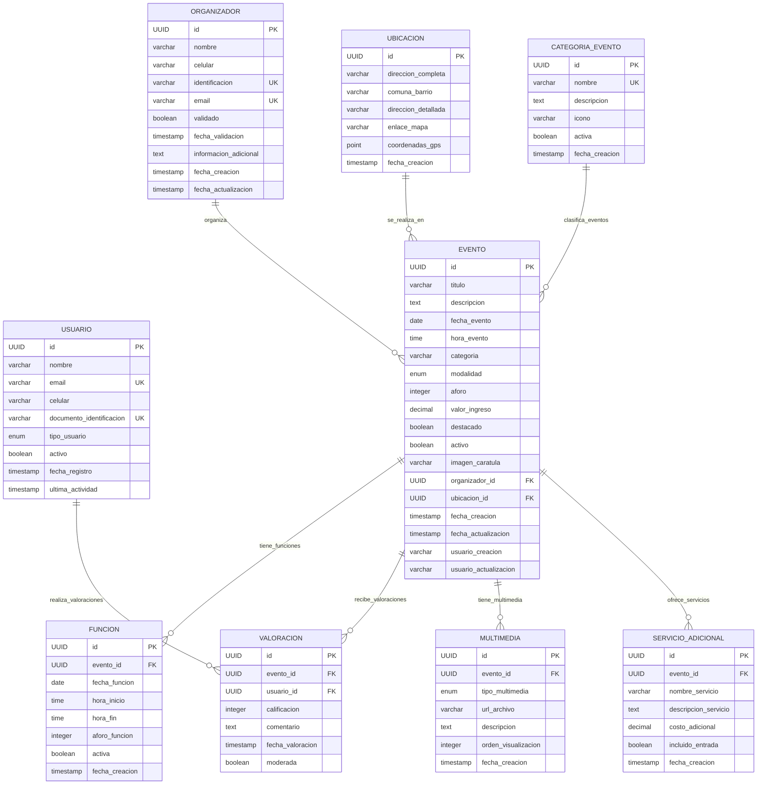

# ENTREGABLE 3: MODELO LÓGICO (MER)
## Proyecto ViveMedellin - Diagrama Entidad-Relación y Modelo Conceptual

---

## 1. INTRODUCCIÓN AL MODELO LÓGICO

### 1.1 Propósito del Documento
Este documento presenta el Modelo Entidad-Relación (MER) completo para la plataforma ViveMedellin, definiendo la estructura lógica de datos que soportará todas las funcionalidades del sistema de gestión de eventos culturales.

### 1.2 Alcance del Modelo
- **Entidades principales:** Gestión central del negocio cultural
- **Entidades de soporte:** Funcionalidades complementarias
- **Entidades de configuración:** Parámetros y catálogos
- **Relaciones:** Todas las interacciones entre entidades

### 1.3 Notación Utilizada
- **Rectángulos:** Entidades
- **Óvalos:** Atributos
- **Rombos:** Relaciones
- **Líneas:** Conexiones entre elementos
- **Subrayado:** Claves primarias
- **Doble línea:** Entidades débiles

---

## 2. MODELO ENTIDAD-RELACIÓN COMPLETO

### 2.1 Diagrama Principal en Notación Chen

```
                             USUARIO
                        ┌─────────────────┐
                        │ • id (PK)       │
                        │ • nombre        │
                        │ • email (UK)    │
                        │ • celular       │
                        │ • documento     │
                        │ • tipo_usuario  │
                        │ • activo        │
                        │ • fecha_registro│
                        └─────────────────┘
                                │
                                │ (1,N)
                                ▼
                           ┌─────────┐
                           │VALORIZA │
                           └─────────┘
                                │
                                │ (1,1)
                                ▼
┌─────────────────────┐                    ┌──────────────────────┐
│    ORGANIZADOR      │                    │       EVENTO         │
│ • id (PK)          │ (1,N)         (1,1)│ • id (PK)           │
│ • nombre           │────────ORGANIZA─────│ • titulo            │
│ • celular          │                    │ • descripcion       │
│ • identificacion   │                    │ • fecha_evento      │
│ • email (UK)       │                    │ • hora_evento       │
│ • validado         │                    │ • categoria         │
│ • fecha_validacion │                    │ • modalidad         │
└─────────────────────┘                    │ • aforo             │
                                          │ • valor_ingreso     │
                                          │ • destacado         │
                                          │ • activo            │
                                          │ • imagen_caratula   │
                                          └──────────────────────┘
                                                     │
                                                     │ (N,1)
                                                     ▼
                                            ┌────────────────┐
                                            │SE_REALIZA_EN   │
                                            └────────────────┘
                                                     │
                                                     │ (1,1)
                                                     ▼
                                          ┌─────────────────────┐
                                          │     UBICACION       │
                                          │ • id (PK)          │
                                          │ • direccion_completa│
                                          │ • comuna_barrio     │
                                          │ • direccion_detallada│
                                          │ • enlace_mapa      │
                                          │ • coordenadas_gps   │
                                          └─────────────────────┘

        ┌─────────────────────┐           ┌──────────────────────┐
        │      FUNCION        │           │      VALORACION      │
        │ • id (PK)          │           │ • id (PK)           │
        │ • fecha_funcion    │ (N,1)     │ • calificacion      │ (N,1)
        │ • hora_inicio      │──TIENE────│ • comentario        │──RECIBE──
        │ • hora_fin         │           │ • fecha_valoracion  │
        │ • aforo_funcion    │           │ • moderada          │
        │ • activa           │           └──────────────────────┘
        └─────────────────────┘
                 │
                 │ (1,1)
                 ▼
            ┌─────────┐
            │PERTENECE│
            └─────────┘
                 │
                 │ (1,N)
                 ▼
┌─────────────────────────────────────────────────────────────────────┐
│                             EVENTO                                   │
└─────────────────────────────────────────────────────────────────────┘

┌─────────────────────┐           ┌──────────────────────┐
│    MULTIMEDIA       │           │ SERVICIO_ADICIONAL   │
│ • id (PK)          │           │ • id (PK)           │
│ • tipo_multimedia  │ (N,1)     │ • nombre_servicio   │ (N,1)
│ • url_archivo      │──ILUSTRA──│ • descripcion       │──OFRECE──
│ • descripcion      │           │ • costo_adicional   │
│ • orden_visual     │           │ • incluido_entrada  │
└─────────────────────┘           └──────────────────────┘
         │                                    │
         │ (1,1)                             │ (1,1)
         ▼                                    ▼
    ┌─────────┐                         ┌─────────┐
    │PERTENECE│                         │PERTENECE│
    └─────────┘                         └─────────┘
         │                                    │
         │ (1,N)                             │ (1,N)
         ▼                                    ▼
┌─────────────────────────────────────────────────────────────────────┐
│                             EVENTO                                   │
└─────────────────────────────────────────────────────────────────────┘

┌─────────────────────┐
│ CATEGORIA_EVENTO    │
│ • id (PK)          │
│ • nombre (UK)      │ (1,N)
│ • descripcion      │──CLASIFICA──
│ • icono            │
│ • activa           │
└─────────────────────┘
         │
         │ (N,1)
         ▼
    ┌─────────┐
    │PERTENECE│
    └─────────┘
         │
         │ (1,1)
         ▼
┌─────────────────────────────────────────────────────────────────────┐
│                             EVENTO                                   │
└─────────────────────────────────────────────────────────────────────┘
```

### 2.2 Diagrama Simplificado en Notación Crow's Foot



---

## 3. DESCRIPCIÓN DETALLADA DE ENTIDADES

### 3.1 Entidades Principales

#### EVENTO
**Definición:** Actividad cultural programada en la ciudad de Medellín  
**Propósito:** Entidad central que representa toda la información de un evento cultural  
**Cardinalidad:** Aproximadamente 10,000 registros por año

**Atributos:**
- `id` (PK): Identificador único UUID
- `titulo`: Nombre descriptivo del evento (5-200 caracteres)
- `descripcion`: Información detallada del evento (10-2000 caracteres)  
- `fecha_evento`: Fecha programada (DATE, no puede ser pasada)
- `hora_evento`: Hora de inicio (TIME)
- `categoria`: Clasificación temática (referencia a catálogo)
- `modalidad`: PRESENCIAL|VIRTUAL|HIBRIDA
- `aforo`: Capacidad máxima de asistentes (entero positivo)
- `valor_ingreso`: Precio de entrada (decimal, >= 0)
- `destacado`: Marcado como evento importante (booleano)
- `activo`: Estado del evento (booleano, soft delete)
- `imagen_caratula`: URL de imagen promocional (opcional)

#### ORGANIZADOR  
**Definición:** Entidad responsable de crear y gestionar eventos  
**Propósito:** Garantizar responsabilidad y punto de contacto para cada evento  
**Cardinalidad:** Aproximadamente 2,000 organizadores activos

**Atributos:**
- `id` (PK): Identificador único UUID
- `nombre`: Nombre o razón social (2-200 caracteres)
- `celular`: Número de contacto (10 dígitos)
- `identificacion` (UK): Cédula o NIT único
- `email` (UK): Correo electrónico único
- `validado`: Estado de verificación por administración
- `fecha_validacion`: Cuándo fue aprobado (automático)
- `informacion_adicional`: Datos complementarios (texto libre)

#### USUARIO
**Definición:** Ciudadanos que interactúan con la plataforma  
**Propósito:** Base para sistema de valoraciones y personalización  
**Cardinalidad:** Aproximadamente 100,000 usuarios registrados

**Atributos:**
- `id` (PK): Identificador único UUID
- `nombre`: Nombre completo (2-200 caracteres)
- `email` (UK): Correo electrónico único
- `celular`: Número de contacto (opcional, 10-15 caracteres)
- `documento_identificacion` (UK): Cédula única (opcional)
- `tipo_usuario`: CIUDADANO|ORGANIZADOR|ADMINISTRADOR
- `activo`: Estado de la cuenta
- `fecha_registro`: Cuándo se registró (automático)
- `ultima_actividad`: Última interacción (automático)

### 3.2 Entidades de Soporte

#### UBICACION
**Definición:** Localización geográfica donde se realizan eventos  
**Propósito:** Geolocalización precisa para búsquedas por proximidad  
**Cardinalidad:** Aproximadamente 5,000 ubicaciones únicas

**Atributos:**
- `id` (PK): Identificador único UUID
- `direccion_completa`: Dirección postal completa (5-300 caracteres)
- `comuna_barrio`: División administrativa oficial (2-100 caracteres)
- `direccion_detallada`: Información específica del lugar (5-300 caracteres)
- `enlace_mapa`: URL a Google Maps u otro servicio (opcional)
- `coordenadas_gps`: Latitud y longitud (POINT, opcional)

#### VALORACION
**Definición:** Calificación y comentario de usuario sobre evento  
**Propósito:** Sistema de retroalimentación y calidad  
**Cardinalidad:** Aproximadamente 50,000 valoraciones por año

**Atributos:**
- `id` (PK): Identificador único UUID
- `calificacion`: Puntuación 1-5 estrellas (entero, validado)
- `comentario`: Texto libre del usuario (opcional, max 1000 caracteres)
- `fecha_valoracion`: Cuándo se creó (automático)
- `moderada`: Si fue revisada por administración

#### FUNCION
**Definición:** Horario específico de un evento (puede repetirse)  
**Propósito:** Manejo de eventos con múltiples fechas/horas  
**Cardinalidad:** 1.5 funciones promedio por evento

**Atributos:**
- `id` (PK): Identificador único UUID
- `fecha_funcion`: Fecha específica de la función
- `hora_inicio`: Hora de inicio
- `hora_fin`: Hora de finalización (opcional)
- `aforo_funcion`: Capacidad específica de esta función
- `activa`: Si la función está disponible

### 3.3 Entidades de Configuración

#### CATEGORIA_EVENTO
**Definición:** Clasificación temática de eventos culturales  
**Propósito:** Organización y filtrado de contenido  
**Cardinalidad:** Aproximadamente 20 categorías predefinidas

**Atributos:**
- `id` (PK): Identificador único UUID
- `nombre` (UK): Nombre único de la categoría
- `descripcion`: Criterios y definición de la categoría
- `icono`: Referencia a símbolo visual
- `activa`: Si está disponible para nuevos eventos

#### MULTIMEDIA
**Definición:** Archivos de imagen, video o audio asociados a eventos  
**Propósito:** Material promocional y documentación visual  
**Cardinalidad:** 2-3 archivos multimedia promedio por evento

**Atributos:**
- `id` (PK): Identificador único UUID
- `tipo_multimedia`: IMAGEN|VIDEO|AUDIO|DOCUMENTO
- `url_archivo`: URL del archivo almacenado
- `descripcion`: Texto alternativo o descripción
- `orden_visualizacion`: Secuencia de presentación

#### SERVICIO_ADICIONAL
**Definición:** Servicios complementarios ofrecidos en eventos  
**Propósito:** Información de valor agregado  
**Cardinalidad:** 0-5 servicios promedio por evento

**Atributos:**
- `id` (PK): Identificador único UUID
- `nombre_servicio`: Nombre del servicio (ej: "Parqueadero")
- `descripcion_servicio`: Detalles del servicio
- `costo_adicional`: Precio extra si aplica
- `incluido_entrada`: Si está incluido en el precio base

---

## 4. DESCRIPCIÓN DETALLADA DE RELACIONES

### 4.1 Relaciones Principales

#### ORGANIZADOR ──organiza──> EVENTO
**Cardinalidad:** 1:N (Un organizador puede crear múltiples eventos)  
**Participación:** Total en EVENTO, Parcial en ORGANIZADOR  
**Reglas de Negocio:**
- Todo evento debe tener exactamente un organizador
- Un organizador puede tener cero o más eventos
- La eliminación de organizador requiere reasignación o eliminación de eventos
- Solo organizadores validados pueden crear nuevos eventos

**Atributos de la Relación:**
- `fecha_asignacion`: Cuándo se asignó el organizador
- `usuario_asignacion`: Quien hizo la asignación (auditoría)

#### EVENTO ──se_realiza_en──> UBICACION  
**Cardinalidad:** N:1 (Múltiples eventos pueden realizarse en la misma ubicación)  
**Participación:** Total en EVENTO, Parcial en UBICACION  
**Reglas de Negocio:**
- Todo evento debe tener exactamente una ubicación
- Una ubicación puede hospedar cero o más eventos
- Las ubicaciones son reutilizables entre eventos
- La modificación de ubicación requiere validación geográfica

#### USUARIO ──valoriza──> EVENTO
**Cardinalidad:** N:M (Muchos usuarios pueden valorar muchos eventos)  
**Participación:** Parcial en ambas entidades  
**Entidad Asociativa:** VALORACION  
**Reglas de Negocio:**
- Un usuario puede valorar múltiples eventos
- Un evento puede ser valorado por múltiples usuarios
- Un usuario solo puede valorar una vez el mismo evento (UK compuesta)
- Solo usuarios registrados y activos pueden valorar

**Atributos de la Relación:**
- `calificacion`: Puntuación obligatoria (1-5)
- `comentario`: Texto opcional
- `fecha_valoracion`: Timestamp de creación
- `moderada`: Estado de revisión

### 4.2 Relaciones de Composición

#### EVENTO ──tiene──> FUNCION
**Cardinalidad:** 1:N (Un evento puede tener múltiples funciones)  
**Participación:** Total en FUNCION, Parcial en EVENTO  
**Tipo:** Composición (existencia dependiente)  
**Reglas de Negocio:**
- Una función no puede existir sin su evento padre
- Al eliminar un evento se eliminan automáticamente sus funciones
- Las funciones heredan restricciones del evento padre
- Mínimo una función por evento (puede ser la misma fecha del evento)

#### EVENTO ──tiene──> MULTIMEDIA
**Cardinalidad:** 1:N (Un evento puede tener múltiples archivos multimedia)  
**Participación:** Total en MULTIMEDIA, Parcial en EVENTO  
**Tipo:** Composición (existencia dependiente)  
**Reglas de Negocio:**
- Un archivo multimedia pertenece a exactamente un evento
- Al eliminar un evento se eliminan sus archivos multimedia
- El orden de visualización es único por evento
- Máximo 10 archivos multimedia por evento (regla de negocio)

#### EVENTO ──ofrece──> SERVICIO_ADICIONAL
**Cardinalidad:** 1:N (Un evento puede ofrecer múltiples servicios)  
**Participación:** Total en SERVICIO_ADICIONAL, Parcial en EVENTO  
**Tipo:** Composición (existencia dependiente)  
**Reglas de Negocio:**
- Un servicio adicional pertenece a exactamente un evento
- Los servicios se eliminan con el evento
- Los costos adicionales se suman al valor base del evento

### 4.3 Relaciones de Clasificación

#### CATEGORIA_EVENTO ──clasifica──> EVENTO
**Cardinalidad:** 1:N (Una categoría puede clasificar múltiples eventos)  
**Participación:** Total en EVENTO, Parcial en CATEGORIA_EVENTO  
**Reglas de Negocio:**
- Todo evento debe tener exactamente una categoría
- Una categoría puede tener cero o más eventos
- Solo categorías activas pueden asignarse a nuevos eventos
- El cambio de categoría requiere validación administrativa

---

## 5. RESTRICCIONES DE INTEGRIDAD

### 5.1 Integridad de Entidad
- Todas las entidades tienen clave primaria UUID no nula
- Las claves primarias son inmutables una vez asignadas
- Generación automática de UUIDs por el sistema

### 5.2 Integridad Referencial

#### Restricciones de Clave Foránea
```sql
-- Eventos deben referenciar organizador válido
ALTER TABLE eventos 
ADD CONSTRAINT fk_evento_organizador 
FOREIGN KEY (organizador_id) REFERENCES organizadores(id) ON DELETE RESTRICT;

-- Eventos deben referenciar ubicación válida  
ALTER TABLE eventos 
ADD CONSTRAINT fk_evento_ubicacion 
FOREIGN KEY (ubicacion_id) REFERENCES ubicaciones(id) ON DELETE RESTRICT;

-- Funciones pertenecen a evento (cascada)
ALTER TABLE funciones 
ADD CONSTRAINT fk_funcion_evento 
FOREIGN KEY (evento_id) REFERENCES eventos(id) ON DELETE CASCADE;

-- Valoraciones referencian evento y usuario
ALTER TABLE valoraciones 
ADD CONSTRAINT fk_valoracion_evento 
FOREIGN KEY (evento_id) REFERENCES eventos(id) ON DELETE CASCADE;

ALTER TABLE valoraciones 
ADD CONSTRAINT fk_valoracion_usuario 
FOREIGN KEY (usuario_id) REFERENCES usuarios(id) ON DELETE CASCADE;
```

#### Restricciones de Unicidad
```sql
-- Un usuario solo puede valorar una vez el mismo evento
ALTER TABLE valoraciones 
ADD CONSTRAINT uk_valoracion_usuario_evento 
UNIQUE (evento_id, usuario_id);

-- Emails únicos en organizadores y usuarios
ALTER TABLE organizadores 
ADD CONSTRAINT uk_organizador_email UNIQUE (email);

ALTER TABLE organizadores 
ADD CONSTRAINT uk_organizador_identificacion UNIQUE (identificacion);

ALTER TABLE usuarios 
ADD CONSTRAINT uk_usuario_email UNIQUE (email);

-- Nombres de categoría únicos
ALTER TABLE categorias_evento 
ADD CONSTRAINT uk_categoria_nombre UNIQUE (nombre);
```

### 5.3 Integridad de Dominio

#### Restricciones de Validación
```sql
-- Validaciones de eventos
ALTER TABLE eventos 
ADD CONSTRAINT ck_evento_fecha_futura 
CHECK (fecha_evento >= CURRENT_DATE);

ALTER TABLE eventos 
ADD CONSTRAINT ck_evento_aforo_positivo 
CHECK (aforo IS NULL OR aforo > 0);

ALTER TABLE eventos 
ADD CONSTRAINT ck_evento_valor_positivo 
CHECK (valor_ingreso >= 0);

-- Validaciones de valoraciones
ALTER TABLE valoraciones 
ADD CONSTRAINT ck_valoracion_calificacion 
CHECK (calificacion >= 1 AND calificacion <= 5);

-- Validaciones de funciones
ALTER TABLE funciones 
ADD CONSTRAINT ck_funcion_fecha_valida 
CHECK (fecha_funcion >= CURRENT_DATE);

ALTER TABLE funciones 
ADD CONSTRAINT ck_funcion_hora_valida 
CHECK (hora_fin IS NULL OR hora_fin > hora_inicio);

-- Validaciones de organizadores
ALTER TABLE organizadores 
ADD CONSTRAINT ck_organizador_celular 
CHECK (celular ~ '^[0-9]{10}$');

ALTER TABLE organizadores 
ADD CONSTRAINT ck_organizador_email 
CHECK (email ~* '^[A-Za-z0-9._%+-]+@[A-Za-z0-9.-]+\.[A-Za-z]{2,}$');
```

### 5.4 Reglas de Negocio Implementadas como Restricciones

```sql
-- Solo organizadores validados pueden tener eventos activos
CREATE OR REPLACE FUNCTION validar_organizador_evento()
RETURNS TRIGGER AS $$
BEGIN
    IF NEW.activo = true THEN
        IF NOT EXISTS (
            SELECT 1 FROM organizadores 
            WHERE id = NEW.organizador_id AND validado = true
        ) THEN
            RAISE EXCEPTION 'Solo organizadores validados pueden crear eventos activos';
        END IF;
    END IF;
    RETURN NEW;
END;
$$ LANGUAGE plpgsql;

CREATE TRIGGER tr_validar_organizador_evento
    BEFORE INSERT OR UPDATE ON eventos
    FOR EACH ROW EXECUTE FUNCTION validar_organizador_evento();
```

---

## 6. NORMALIZACIÓN Y FORMA NORMAL

### 6.1 Análisis de Formas Normales

#### Primera Forma Normal (1FN) ✅
- Todos los atributos son atómicos
- No hay grupos repetitivos
- Cada celda contiene un solo valor

#### Segunda Forma Normal (2FN) ✅  
- Cumple 1FN
- No hay dependencias parciales de la clave primaria
- Todos los atributos no clave dependen completamente de la clave primaria

#### Tercera Forma Normal (3FN) ✅
- Cumple 2FN  
- No hay dependencias transitivas
- Los atributos no clave no dependen de otros atributos no clave

#### Forma Normal Boyce-Codd (FNBC) ✅
- Cumple 3FN
- Toda dependencia funcional X → Y tiene X como superclave

### 6.2 Dependencias Funcionales Identificadas

#### En Entidad EVENTO:
- `id` → {titulo, descripcion, fecha_evento, hora_evento, ...}
- `organizador_id` → organizador.nombre (transitiva, normalizada en tabla separada)
- `ubicacion_id` → ubicacion.direccion_completa (transitiva, normalizada)

#### En Entidad VALORACION:
- `id` → {calificacion, comentario, fecha_valoracion, ...}
- `{evento_id, usuario_id}` → {calificacion, comentario, ...} (clave alternativa)

#### En Entidad UBICACION:
- `id` → {direccion_completa, comuna_barrio, ...}
- `{direccion_completa, comuna_barrio}` → coordenadas_gps (dependencia funcional aproximada)

---

## 7. EXTENSIONES FUTURAS DEL MODELO

### 7.1 Entidades Adicionales Contempladas

#### NOTIFICACION
**Propósito:** Sistema de alertas y comunicaciones a usuarios  
**Relaciones:** N:1 con USUARIO, N:1 con EVENTO  
**Justificación:** Mejorar engagement y comunicación

#### INSCRIPCION  
**Propósito:** Registro formal de asistencia a eventos  
**Relaciones:** N:M entre USUARIO y EVENTO  
**Justificación:** Control de aforo y lista de asistentes

#### PAGO
**Propósito:** Procesamiento de transacciones para eventos pagos  
**Relaciones:** N:1 con EVENTO, N:1 con USUARIO  
**Justificación:** Monetización y control financiero

### 7.2 Atributos Adicionales Futuros

#### En EVENTO:
- `capacidad_virtual`: Para eventos híbridos
- `requisitos_acceso`: Condiciones especiales
- `politica_cancelacion`: Términos y condiciones

#### En USUARIO:
- `preferencias_categoria`: Para recomendaciones personalizadas
- `historial_asistencia`: Seguimiento de participación
- `puntos_fidelidad`: Sistema de gamificación

### 7.3 Nuevas Relaciones Contempladas

#### EVENTO ──requiere──> RECURSO
**Propósito:** Gestión de recursos físicos necesarios  
**Ejemplos:** Equipos, permisos, personal

#### USUARIO ──sigue──> ORGANIZADOR  
**Propósito:** Sistema de seguimiento y notificaciones  
**Beneficio:** Fidelización y engagement

#### EVENTO ──depende_de──> EVENTO
**Propósito:** Eventos relacionados o secuenciales  
**Ejemplos:** Festivales con múltiples eventos

---

## 8. CONSIDERACIONES DE IMPLEMENTACIÓN

### 8.1 Estrategia de Claves

#### Claves Primarias
- **UUID v4:** Para todas las entidades principales
- **Ventajas:** Distribución global, no secuencial, seguridad
- **Desventajas:** Mayor espacio de almacenamiento

#### Claves Foráneas
- **Índices automáticos:** En todas las FK para performance
- **Restricciones de integridad:** RESTRICT para entidades principales, CASCADE para dependientes

### 8.2 Estrategia de Soft Delete

#### Entidades con Soft Delete:
- `eventos.activo`: Para preservar historial
- `usuarios.activo`: Para cumplimiento GDPR
- `categorias_evento.activa`: Para evolución de catálogos

#### Entidades con Hard Delete:
- `funciones`: Dependientes de eventos
- `multimedia`: Archivos pueden eliminarse físicamente
- `valoraciones`: Pueden eliminarse por moderación

### 8.3 Auditoria y Trazabilidad

#### Campos de Auditoria Standard:
```sql
-- En todas las entidades principales
fecha_creacion TIMESTAMP WITH TIME ZONE DEFAULT CURRENT_TIMESTAMP,
fecha_actualizacion TIMESTAMP WITH TIME ZONE DEFAULT CURRENT_TIMESTAMP,
usuario_creacion VARCHAR(100),
usuario_actualizacion VARCHAR(100)
```

#### Triggers de Auditoria:
- Actualización automática de `fecha_actualizacion`
- Registro de cambios en tabla de auditoria
- Preservación de versiones anteriores para entidades críticas

---

## 9. VALIDACIÓN DEL MODELO

### 9.1 Casos de Uso Cubiertos

✅ **CU-01:** Organizador crea evento  
- Entidades: ORGANIZADOR → EVENTO → UBICACION  
- Validación: Organizador validado, ubicación válida

✅ **CU-02:** Usuario valorar evento  
- Entidades: USUARIO → VALORACION ← EVENTO  
- Validación: Usuario único por evento, calificación 1-5

✅ **CU-03:** Buscar eventos por ubicación  
- Entidades: EVENTO → UBICACION  
- Índices: comuna_barrio, coordenadas_gps

✅ **CU-04:** Gestionar funciones de evento  
- Entidades: EVENTO → FUNCION  
- Validación: Fechas futuras, horas lógicas

### 9.2 Consultas Críticas Soportadas

✅ **Búsqueda por proximidad:** EVENTO → UBICACION  
✅ **Ranking por valoración:** EVENTO → VALORACION  
✅ **Eventos por organizador:** ORGANIZADOR → EVENTO  
✅ **Dashboard organizador:** Múltiples agregaciones soportadas

### 9.3 Reglas de Negocio Implementadas

✅ **RN-01:** Todo evento tiene organizador validado  
✅ **RN-02:** Usuario valorar una sola vez por evento  
✅ **RN-03:** Eventos geolocalizados en Medellín  
✅ **RN-04:** Valoraciones entre 1-5 estrellas  
✅ **RN-05:** Clasificación obligatoria por categoría

---

## 10. CONCLUSIONES Y RECOMENDACIONES

### 10.1 Fortalezas del Modelo
- **Completitud:** Cubre todos los requerimientos identificados
- **Flexibilidad:** Permite extensiones futuras sin reestructuración mayor  
- **Integridad:** Restricciones robustas garantizan calidad de datos
- **Performance:** Diseño optimizado para consultas críticas
- **Escalabilidad:** Estructura preparada para crecimiento

### 10.2 Áreas de Atención
- **Complejidad:** Modelo robusto requiere documentación detallada
- **Performance:** Monitoreo continuo de consultas complejas
- **Mantenimiento:** Estrategia clara para evolución de esquema
- **Backup:** Consideraciones especiales para UUIDs y relaciones

### 10.3 Próximos Pasos
1. **Validación con stakeholders:** Revisión del modelo conceptual
2. **Creación del modelo físico:** Implementación en PostgreSQL
3. **Pruebas de integridad:** Validación de restricciones
4. **Optimización inicial:** Creación de índices críticos
5. **Documentación de APIs:** Mapping objeto-relacional

---

**Documento:** Entregable 3 - Modelo Lógico (MER)  
**Fecha:** Septiembre 2025  
**Estado:** Aprobado para implementación física  
**Próximo paso:** Creación de scripts DDL para PostgreSQL